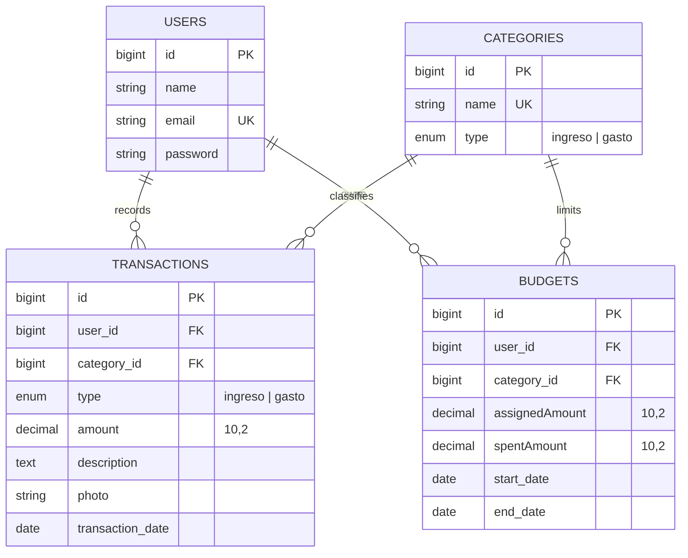
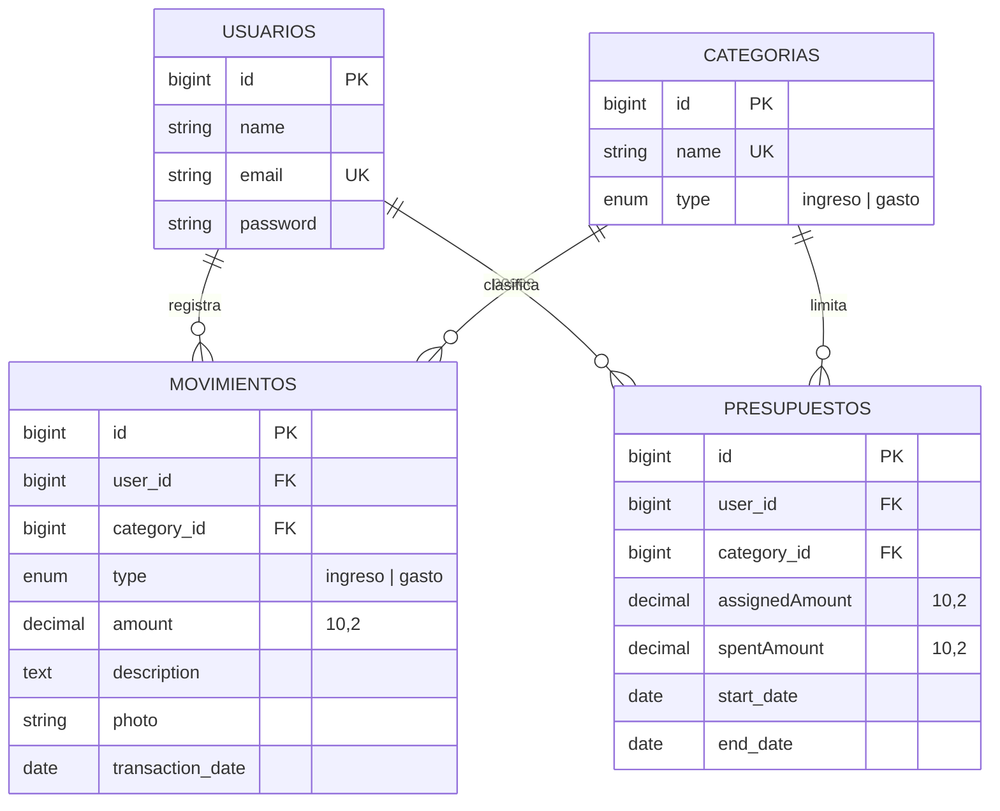

<h1 align="center">MoneyMind</h1>

<p align="center">
  <strong>Personal finance manager built with Laravel 12 and Filament 3.</strong><br>
  <em>Gestor de finanzas personales construido con Laravel 12 y Filament 3.</em>
</p>

<p align="center">
  
  
  
  
  
  
</p>

<p align="center">
  <a href="#-english">English</a> &nbsp;•&nbsp; <a href="#-español">Español</a>
</p>

---

<a name="-english"></a>

# 🇬🇧 English

## Overview

**MoneyMind** is a web application for tracking personal finances. It lets you record income and
expenses, organise them into categories, define monthly budgets per category, and review the
resulting picture on an analytics dashboard.

The entire experience is delivered through a **Filament** admin panel, so the application ships with
authentication, CRUD screens, filters, notifications, and charts out of the box. The interface is
fully localised in **Spanish**.

> **Note** — The application locale is fixed to `es` in `config/app.php`. This README is bilingual,
> but the running product speaks Spanish.

## ✨ Features

| Module | Description |
| --- | --- |
| 🔐 **Authentication** | Session-based login provided by the Filament panel at `/admin/login`. |
| 🏷️ **Categories** | Create categories typed as *income* (`ingreso`) or *expense* (`gasto`), with colour-coded badges and type filtering. |
| 💸 **Transactions** | Record movements with amount, category, rich-text description, receipt photo, and date. Filterable by type. |
| 📊 **Budgets** | Assign a monthly amount per user and category, with an automatically tracked spent amount. |
| 📈 **Dashboard** | Stat cards (users, categories, total income) plus monthly line charts for income and expenses. |
| 🔔 **Notifications** | Confirmation toasts on every delete and bulk-delete action. |
| 🖼️ **File uploads** | Receipt images stored on the `public` disk under `storage/app/public/transactions`. |

### Automatic budget tracking

When a transaction of type `gasto` is created, a model observer looks for a budget that matches the
same user and category within the current month, and increments its `spentAmount` field. The logic
lives in [Transaction.php:31-48](app/Models/Transaction.php#L31-L48).

## 🧱 Tech stack

| Layer | Technology |
| --- | --- |
| Language | PHP 8.2+ (developed on 8.3) |
| Framework | Laravel 12.x |
| Admin / UI | Filament 3.3 (Livewire, Alpine.js) |
| Styling | Tailwind CSS 4 |
| Build tool | Vite 6 |
| Database | MySQL 8 (SQLite in-memory for tests) |
| Testing | Pest 3 + Pest Laravel plugin |
| Code style | Laravel Pint |
| Logs | Laravel Pail |

## 🗂️ Project structure

```
MoneyMind/
├── app/
│   ├── Filament/
│   │   ├── Resources/            # CRUD screens
│   │   │   ├── CategoryResource.php
│   │   │   ├── TransactionResource.php
│   │   │   └── BudgetResource.php
│   │   └── Widgets/              # Dashboard widgets
│   │       ├── Dashboard.php     # Stats overview
│   │       ├── IncomeChart.php   # Monthly income line chart
│   │       └── ExpensesChart.php # Monthly expenses line chart
│   ├── Models/                   # Eloquent models
│   │   ├── User.php
│   │   ├── Category.php
│   │   ├── Transaction.php
│   │   └── Budget.php
│   └── Providers/
│       └── Filament/AdminPanelProvider.php   # Panel configuration
├── database/
│   ├── migrations/               # Schema definitions
│   └── seeders/DatabaseSeeder.php # Demo users + categories
├── public/
│   └── diagram.dbml              # Entity-relationship diagram (dbdiagram.io)
├── resources/                    # CSS, JS and Blade views
├── routes/web.php                # Public landing route
└── tests/                        # Pest test suite
```

## 🗄️ Data model



All foreign keys use `ON DELETE CASCADE`. A source diagram compatible with
[dbdiagram.io](https://dbdiagram.io) is available at [public/diagram.dbml](public/diagram.dbml).

## ⚙️ Requirements

- PHP **8.2** or higher
- Composer 2
- Node.js 18+ and npm
- MySQL 8 (or MariaDB 10.6+)

Required PHP extensions: `pdo_mysql`, `mbstring`, `openssl`, `fileinfo`, `gd` (image uploads),
`intl`, `zip`.

## 🚀 Installation

```bash
# 1. Clone the repository
git clone https://github.com/xEdwardP/MoneyMind.git
cd MoneyMind

# 2. Install PHP and JavaScript dependencies
composer install
npm install

# 3. Set up the environment file
cp .env.example .env
php artisan key:generate

# 4. Create the database (MySQL)
#    Then adjust DB_* values in .env if needed
mysql -u root -e "CREATE DATABASE moneymind CHARACTER SET utf8mb4 COLLATE utf8mb4_unicode_ci;"

# 5. Run migrations and load demo data
php artisan migrate --seed

# 6. Link the storage disk (required for receipt photos)
php artisan storage:link

# 7. Build front-end assets
npm run build
```

### Relevant environment variables

| Variable | Default | Purpose |
| --- | --- | --- |
| `APP_NAME` | `Laravel` | Application name shown in the UI. Set it to `MoneyMind`. |
| `APP_URL` | `http://localhost` | Base URL used to generate links and asset paths. |
| `DB_CONNECTION` | `mysql` | Database driver. |
| `DB_DATABASE` | `moneymind` | Database name. |
| `DB_USERNAME` / `DB_PASSWORD` | `root` / *(empty)* | Database credentials. |
| `FILESYSTEM_DISK` | `local` | Storage disk. Receipt uploads explicitly target the `public` disk. |
| `SESSION_DRIVER` | `database` | Sessions are stored in the database. |
| `QUEUE_CONNECTION` | `database` | Queued jobs are stored in the database. |
| `CACHE_STORE` | `database` | Cache entries are stored in the database. |

## ▶️ Running the application

The project ships with a single command that starts the PHP server, the queue worker, and Vite
concurrently:

```bash
composer run dev
```

Or run each process yourself:

```bash
php artisan serve          # http://localhost:8000
php artisan queue:listen   # background jobs
npm run dev                # Vite dev server with hot reload
```

Then open the admin panel:

| URL | Description |
| --- | --- |
| `http://localhost:8000` | Public landing page |
| `http://localhost:8000/admin` | Filament admin panel (dashboard) |
| `http://localhost:8000/admin/login` | Login screen |
| `http://localhost:8000/up` | Health-check endpoint |

### Demo credentials

Created by `php artisan db:seed`:

| Email | Password |
| --- | --- |
| `epineda@yopmail.com` | `12345678` |
| `jbodoque@yopmail.com` | `12345678` |
| `aguilar@yopmail.com` | `12345678` |

> **Warning** — These accounts are for local development only. Never seed them in production.

To create your own administrator account instead:

```bash
php artisan make:filament-user
```

## 🧭 Usage guide

1. **Create categories** — Go to *Categorías* and add the categories you need, marking each one as
   `Ingreso` or `Gasto`. Ten sample categories are pre-loaded by the seeder.
2. **Define budgets** — In *Presupuestos*, assign an amount to a user/category pair and set the
   start and end dates. The spent amount is read-only; it updates by itself.
3. **Record transactions** — In *Movimientos*, register each income or expense with its amount,
   description, optional receipt photo, and date (limited to ±1 year from today).
4. **Review the dashboard** — The home screen of the panel shows totals and monthly evolution
   charts for income and expenses.

## 🧪 Testing

```bash
composer test          # clears config cache, then runs the suite
# or
php artisan test
./vendor/bin/pest      # run Pest directly
```

Tests run against an in-memory SQLite database configured in [phpunit.xml](phpunit.xml), so they
never touch your development data.

## 🎨 Code style

```bash
./vendor/bin/pint          # apply Laravel Pint formatting
./vendor/bin/pint --test   # check without modifying files
```

Editor settings (UTF-8, LF line endings, 4-space indentation) are enforced by
[.editorconfig](.editorconfig).

## 🔧 Useful commands

| Command | Description |
| --- | --- |
| `php artisan migrate:fresh --seed` | Rebuild the database from scratch and reseed it. |
| `php artisan storage:link` | Create the public symlink for uploaded receipts. |
| `php artisan make:filament-user` | Create a new panel user interactively. |
| `php artisan filament:upgrade` | Republish Filament assets after an update. |
| `php artisan optimize` | Cache config, routes, and views for production. |
| `php artisan optimize:clear` | Clear every application cache. |
| `php artisan pail` | Tail application logs in real time. |

## 🚢 Production notes

```bash
composer install --no-dev --optimize-autoloader
npm run build
php artisan migrate --force
php artisan optimize
```

Also make sure that `APP_DEBUG=false`, `APP_ENV=production`, a real `APP_KEY` is set, and that
`storage/` and `bootstrap/cache/` are writable by the web server.

## 🗺️ Roadmap

- [ ] Scope transactions and budgets to the authenticated user automatically
- [ ] Budget alerts when the spent amount approaches the assigned amount
- [ ] Recalculate `spentAmount` when a transaction is edited or deleted
- [ ] Export reports to CSV / PDF
- [ ] Multi-currency support
- [ ] English translation of the interface

## 🤝 Contributing

1. Fork the repository and create a branch: `git checkout -b feat/my-feature`
2. Follow the existing style and run `./vendor/bin/pint` before committing
3. Write commit messages using [Conventional Commits](https://www.conventionalcommits.org/)
4. Make sure `composer test` passes
5. Open a pull request describing the change

## 📄 License

Released under the [MIT License](https://opensource.org/licenses/MIT).

---

<a name="-español"></a>

# 🇪🇸 Español

## Descripción general

**MoneyMind** es una aplicación web para el control de finanzas personales. Permite registrar
ingresos y gastos, organizarlos por categorías, definir presupuestos mensuales por categoría y
revisar el panorama resultante en un tablero analítico.

Toda la experiencia se entrega a través de un panel de administración de **Filament**, por lo que la
aplicación incluye de fábrica autenticación, pantallas CRUD, filtros, notificaciones y gráficos. La
interfaz está completamente localizada en **español**.

> **Nota** — El idioma de la aplicación está fijado en `es` dentro de `config/app.php`. Este README
> es bilingüe, pero el producto en ejecución está en español.

## ✨ Características

| Módulo | Descripción |
| --- | --- |
| 🔐 **Autenticación** | Inicio de sesión por sesión provisto por el panel de Filament en `/admin/login`. |
| 🏷️ **Categorías** | Creación de categorías de tipo *ingreso* o *gasto*, con distintivos de color y filtrado por tipo. |
| 💸 **Movimientos** | Registro de transacciones con monto, categoría, descripción enriquecida, foto del comprobante y fecha. Filtrables por tipo. |
| 📊 **Presupuestos** | Asignación de un monto mensual por usuario y categoría, con seguimiento automático del monto gastado. |
| 📈 **Tablero** | Tarjetas de estadísticas (usuarios, categorías, total de ingresos) y gráficos de líneas mensuales de ingresos y gastos. |
| 🔔 **Notificaciones** | Avisos de confirmación en cada eliminación individual y masiva. |
| 🖼️ **Carga de archivos** | Imágenes de comprobantes almacenadas en el disco `public`, dentro de `storage/app/public/transactions`. |

### Seguimiento automático de presupuestos

Cuando se crea un movimiento de tipo `gasto`, un observador del modelo busca un presupuesto que
coincida con el mismo usuario y categoría dentro del mes en curso e incrementa su campo
`spentAmount`. La lógica se encuentra en
[Transaction.php:31-48](app/Models/Transaction.php#L31-L48).

## 🧱 Tecnologías

| Capa | Tecnología |
| --- | --- |
| Lenguaje | PHP 8.2+ (desarrollado sobre 8.3) |
| Framework | Laravel 12.x |
| Panel / interfaz | Filament 3.3 (Livewire, Alpine.js) |
| Estilos | Tailwind CSS 4 |
| Empaquetador | Vite 6 |
| Base de datos | MySQL 8 (SQLite en memoria para pruebas) |
| Pruebas | Pest 3 + complemento Pest Laravel |
| Estilo de código | Laravel Pint |
| Registros | Laravel Pail |

## 🗂️ Estructura del proyecto

```
MoneyMind/
├── app/
│   ├── Filament/
│   │   ├── Resources/            # Pantallas CRUD
│   │   │   ├── CategoryResource.php
│   │   │   ├── TransactionResource.php
│   │   │   └── BudgetResource.php
│   │   └── Widgets/              # Widgets del tablero
│   │       ├── Dashboard.php     # Resumen de estadísticas
│   │       ├── IncomeChart.php   # Gráfico mensual de ingresos
│   │       └── ExpensesChart.php # Gráfico mensual de gastos
│   ├── Models/                   # Modelos de Eloquent
│   │   ├── User.php
│   │   ├── Category.php
│   │   ├── Transaction.php
│   │   └── Budget.php
│   └── Providers/
│       └── Filament/AdminPanelProvider.php   # Configuración del panel
├── database/
│   ├── migrations/               # Definición del esquema
│   └── seeders/DatabaseSeeder.php # Usuarios y categorías de demostración
├── public/
│   └── diagram.dbml              # Diagrama entidad-relación (dbdiagram.io)
├── resources/                    # CSS, JS y vistas Blade
├── routes/web.php                # Ruta pública de inicio
└── tests/                        # Suite de pruebas Pest
```

## 🗄️ Modelo de datos



Todas las claves foráneas usan `ON DELETE CASCADE`. En [public/diagram.dbml](public/diagram.dbml)
hay un diagrama fuente compatible con [dbdiagram.io](https://dbdiagram.io).

## ⚙️ Requisitos

- PHP **8.2** o superior
- Composer 2
- Node.js 18+ y npm
- MySQL 8 (o MariaDB 10.6+)

Extensiones de PHP necesarias: `pdo_mysql`, `mbstring`, `openssl`, `fileinfo`, `gd` (carga de
imágenes), `intl`, `zip`.

## 🚀 Instalación

```bash
# 1. Clonar el repositorio
git clone https://github.com/xEdwardP/MoneyMind.git
cd MoneyMind

# 2. Instalar dependencias de PHP y JavaScript
composer install
npm install

# 3. Preparar el archivo de entorno
cp .env.example .env
php artisan key:generate

# 4. Crear la base de datos (MySQL)
#    Luego ajustar los valores DB_* en .env si es necesario
mysql -u root -e "CREATE DATABASE moneymind CHARACTER SET utf8mb4 COLLATE utf8mb4_unicode_ci;"

# 5. Ejecutar las migraciones y cargar los datos de demostración
php artisan migrate --seed

# 6. Enlazar el disco de almacenamiento (necesario para las fotos de comprobantes)
php artisan storage:link

# 7. Compilar los recursos del front-end
npm run build
```

### Variables de entorno relevantes

| Variable | Valor por defecto | Propósito |
| --- | --- | --- |
| `APP_NAME` | `Laravel` | Nombre de la aplicación mostrado en la interfaz. Conviene fijarlo en `MoneyMind`. |
| `APP_URL` | `http://localhost` | URL base para generar enlaces y rutas de recursos. |
| `DB_CONNECTION` | `mysql` | Controlador de base de datos. |
| `DB_DATABASE` | `moneymind` | Nombre de la base de datos. |
| `DB_USERNAME` / `DB_PASSWORD` | `root` / *(vacío)* | Credenciales de la base de datos. |
| `FILESYSTEM_DISK` | `local` | Disco de almacenamiento. Las cargas de comprobantes usan explícitamente el disco `public`. |
| `SESSION_DRIVER` | `database` | Las sesiones se almacenan en la base de datos. |
| `QUEUE_CONNECTION` | `database` | Los trabajos en cola se almacenan en la base de datos. |
| `CACHE_STORE` | `database` | Las entradas de caché se almacenan en la base de datos. |

## ▶️ Ejecución

El proyecto incluye un único comando que levanta simultáneamente el servidor de PHP, el trabajador
de colas y Vite:

```bash
composer run dev
```

O bien, ejecutando cada proceso por separado:

```bash
php artisan serve          # http://localhost:8000
php artisan queue:listen   # trabajos en segundo plano
npm run dev                # servidor de desarrollo de Vite con recarga en caliente
```

Luego abre el panel de administración:

| URL | Descripción |
| --- | --- |
| `http://localhost:8000` | Página pública de inicio |
| `http://localhost:8000/admin` | Panel de administración de Filament (tablero) |
| `http://localhost:8000/admin/login` | Pantalla de inicio de sesión |
| `http://localhost:8000/up` | Endpoint de comprobación de estado |

### Credenciales de demostración

Creadas por `php artisan db:seed`:

| Correo | Contraseña |
| --- | --- |
| `epineda@yopmail.com` | `12345678` |
| `jbodoque@yopmail.com` | `12345678` |
| `aguilar@yopmail.com` | `12345678` |

> **Advertencia** — Estas cuentas son únicamente para desarrollo local. Nunca las cargues en
> producción.

Para crear tu propia cuenta de administrador:

```bash
php artisan make:filament-user
```

## 🧭 Guía de uso

1. **Crear categorías** — Entra en *Categorías* y agrega las que necesites, marcando cada una como
   `Ingreso` o `Gasto`. El seeder precarga diez categorías de ejemplo.
2. **Definir presupuestos** — En *Presupuestos*, asigna un monto a un par usuario/categoría y
   establece las fechas de inicio y fin. El monto gastado es de solo lectura: se actualiza solo.
3. **Registrar movimientos** — En *Movimientos*, registra cada ingreso o gasto con su monto,
   descripción, foto del comprobante (opcional) y fecha (limitada a ±1 año desde hoy).
4. **Revisar el tablero** — La pantalla principal del panel muestra los totales y los gráficos de
   evolución mensual de ingresos y gastos.

## 🧪 Pruebas

```bash
composer test          # limpia la caché de configuración y ejecuta la suite
# o bien
php artisan test
./vendor/bin/pest      # ejecutar Pest directamente
```

Las pruebas se ejecutan contra una base de datos SQLite en memoria configurada en
[phpunit.xml](phpunit.xml), por lo que nunca afectan tus datos de desarrollo.

## 🎨 Estilo de código

```bash
./vendor/bin/pint          # aplicar el formato de Laravel Pint
./vendor/bin/pint --test   # verificar sin modificar archivos
```

Las convenciones del editor (UTF-8, saltos de línea LF, indentación de 4 espacios) están definidas
en [.editorconfig](.editorconfig).

## 🔧 Comandos útiles

| Comando | Descripción |
| --- | --- |
| `php artisan migrate:fresh --seed` | Reconstruir la base de datos desde cero y volver a sembrarla. |
| `php artisan storage:link` | Crear el enlace simbólico público para los comprobantes cargados. |
| `php artisan make:filament-user` | Crear un nuevo usuario del panel de forma interactiva. |
| `php artisan filament:upgrade` | Volver a publicar los recursos de Filament tras una actualización. |
| `php artisan optimize` | Cachear configuración, rutas y vistas para producción. |
| `php artisan optimize:clear` | Limpiar todas las cachés de la aplicación. |
| `php artisan pail` | Ver los registros de la aplicación en tiempo real. |

## 🚢 Notas para producción

```bash
composer install --no-dev --optimize-autoloader
npm run build
php artisan migrate --force
php artisan optimize
```

Asegúrate además de que `APP_DEBUG=false`, `APP_ENV=production`, que exista una `APP_KEY` real y que
los directorios `storage/` y `bootstrap/cache/` tengan permisos de escritura para el servidor web.

## 🗺️ Hoja de ruta

- [ ] Limitar automáticamente movimientos y presupuestos al usuario autenticado
- [ ] Alertas de presupuesto cuando el monto gastado se aproxime al asignado
- [ ] Recalcular `spentAmount` al editar o eliminar un movimiento
- [ ] Exportación de reportes a CSV / PDF
- [ ] Soporte multimoneda
- [ ] Traducción de la interfaz al inglés

## 🤝 Contribuciones

1. Haz un fork del repositorio y crea una rama: `git checkout -b feat/mi-funcionalidad`
2. Respeta el estilo existente y ejecuta `./vendor/bin/pint` antes de confirmar
3. Escribe los mensajes de commit siguiendo [Conventional Commits](https://www.conventionalcommits.org/)
4. Verifica que `composer test` pase sin errores
5. Abre un pull request describiendo el cambio

## 📄 Licencia

Distribuido bajo la [Licencia MIT](https://opensource.org/licenses/MIT).

---

<p align="center">
  Desarrollado por <a href="https://github.com/xEdwardP">Edward J. Pineda</a>
</p>
